# **Tema 1 — Introducere in Machine Learning**

*Simion George Constantin – 333CB*

## **1. Explorarea Datelor (EDA)**

Setul de date contine 18802 exemple si 43 coloane (32 numerice si 9 categoriale, plus cele 2 tinte). Setul de antrenare a fost impartit in 80% antrenare si 20% validare, rezultand 15041 exemple pentru antrenare si 3761 pentru validare.

## **1.1 Analiza tipului de atribute si a plajei de valori a acestora**

Setul are doua categorii de atribute: numerice (in special reprezemntat de activitatea pe platforma "clicks\_\*", scoruri timpurii si credite) si categoriale (modul, prezentare, regiune, gen, nivel de educatie, banda IMD, varsta, dizabilitate, frecventa de click).

Pentru atributele numerice am extras urmatoarele statistici:

| Atribut                   | count | mean   | std    | min | 25%   | 50%   | 75%   | max   |
|---------------------------|-------|--------|--------|-----|-------|-------|-------|-------|
| studied_credits           | 15041 | 80.72  | 37.36  | 30  | 60    | 60    | 120   | 430   |
| mean_score_early          | 15013 | 74.35  | 17.19  | 0   | 66.67 | 78.33 | 86.67 | 100   |
| weighted_mean_score_early | 15023 | 73.38  | 16.64  | 0   | 64.93 | 76.00 | 85.61 | 100   |
| total_clicks_early        | 15041 | 786.02 | 848.95 | 0   | 261   | 519   | 1001  | 10143 |
| num_of_prev_attempts      | 15041 | 0.17   | 0.48   | 0   | 0     | 0     | 0     | 6     |

Pentru atributele categoriale am extras numarul de exemple non-NaN si numarul de valori unice:

| Atribut           | count | n_unique |
|-------------------|-------|----------|
| code_module       | 15041 | 6        |
| code_presentation | 15041 | 4        |
| gender            | 15041 | 2        |
| region            | 15041 | 13       |
| highest_education | 15041 | 5        |
| imd_band-         | 14415 | 10       |
| age_band          | 15041 | 3        |
| disability        | 15041 | 2        |
| clicks_freq_init  | 14991 | 3        |

Analizand atributul studied\_credits in tabelul de mai sus, observam ca media este de aproximativ 80.72 credite. Distributia centrala este concentrata (50% dintre studenti au pana la 60 de credite, iar 75% se incadreaza sub 120), insa valoarea maxima atinge 430 de credite. Boxplot-ul arata existenta unor outliers in partea superioara, pe care le tratez prin metoda IQR in faza de preprocesare.

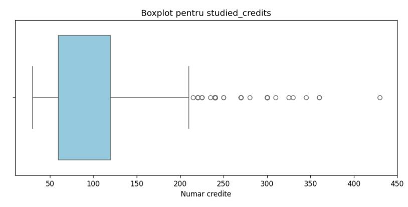

Pentru atributele region (13 valori unice) si highest\_education (5 valori unice), toate cele

15041 de exemple sunt valide (zero date lipsa). Histogramele indica o variatie naturala a datelor, cu regiuni dominante si cu o concentrare mare a studentilor in zonele educationale de nivel mediu.

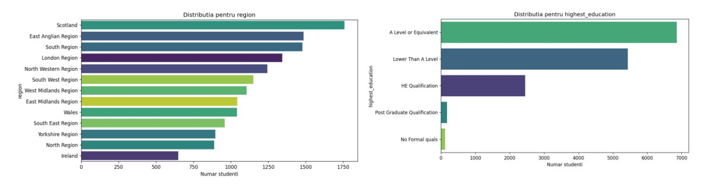

### **1.2 Analiza echilibrului de clase**

Distributia variabilei tinta de clasificare final\_result:

| Clasa       | Numar exemple | Procent |
|-------------|---------------|---------|
| Pass        | 7185          | 47.8%   |
| Fail        | 3330          | 22.1%   |
| Withdrawn   | 2853          | 19.0%   |
| Distinction | 1673          | 11.1%   |

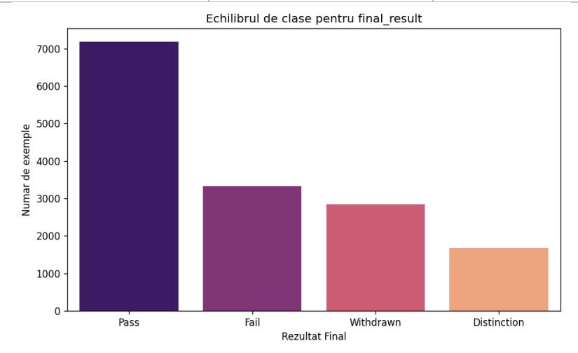

Raportul max/min este de 4.29, ceea ce indica un dezechilibru moderat. Clasa Pass domina, iar Distinction este cea mai rara. Deoarece acuratetea ar fi mica in acest context (adica un model care prezice doar Pass ar avea ~48% acuratete fara sa invete nimic), pe parcursul antrenarii am afisat si metricile precizie, recall si F1 macro pentru a observa invatarea, iar pe sklearn am folosit class\_weight='balanced' pentru a compensa dezechilibrul.

### **1.3 Analiza corelatiilor**

### **a) Numeric vs. Clasificare (studied\_credits vs final\_result):**

Distributia numarului de credite este foarte asemanatoare pentru toate cele 4 clase finale, mediile si medianele fiind grupate strans. Astfel, cantitatea de credite studiate nu este un predictor puternic singular pentru succesul sau abandonul cursului

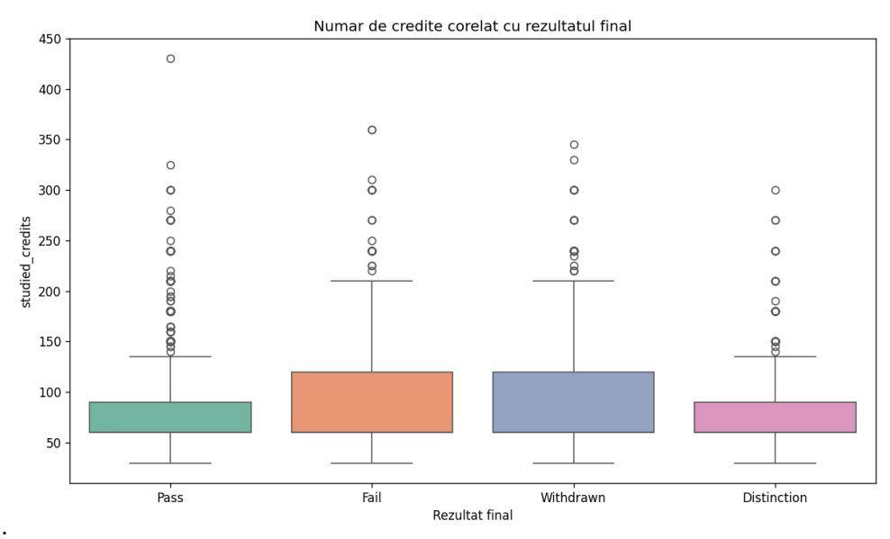

### **b) Categorial vs. Clasificare (gender vs final\_result):**

Distributia ratelor de promovabilitate si abandon este extrem de similara intre genuri (de exemplu, clasa Pass reprezinta 49.5% pentru femei si 46.6% pentru barbati). Atributul are o putere de diferentiere foarte redusa.

| Gender | Distinction | Fail | Pass | Withdrawn |
|--------|-------------|------|------|-----------|
| M      | 11.0        | 21.3 | 49.5 | 18.2      |
| F      | 11.2        | 22.7 | 46.6 | 19.5      |

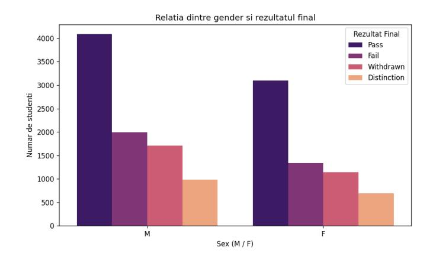

#### **c) Numeric vs. Regresie (mean\_score\_early vs scor final):**

Se observa o corelatie pozitiva: din linia de trend tragem concluzia ca studentii care obtin un scor mediu ridicat la inceputul cursului tind sa obtina note mari si la final.

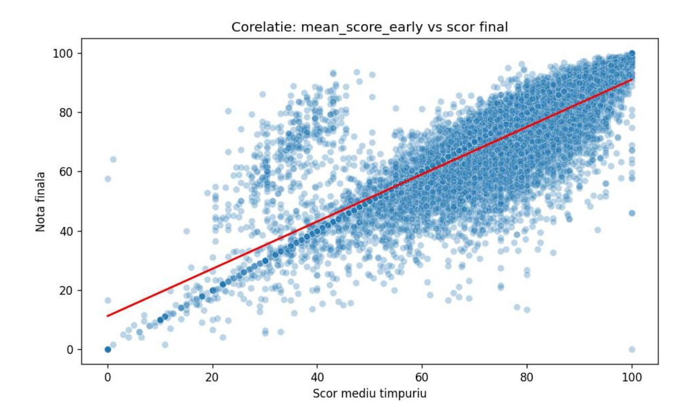

### **d) Categorial vs. Regresie (highest\_education vs scor final):**

Nivelul de educatie anterior influenteaza direct performanta academica. Exista o tendinta clara de crestere a notelor mediane odata cu avansarea in nivelul de pregatire.

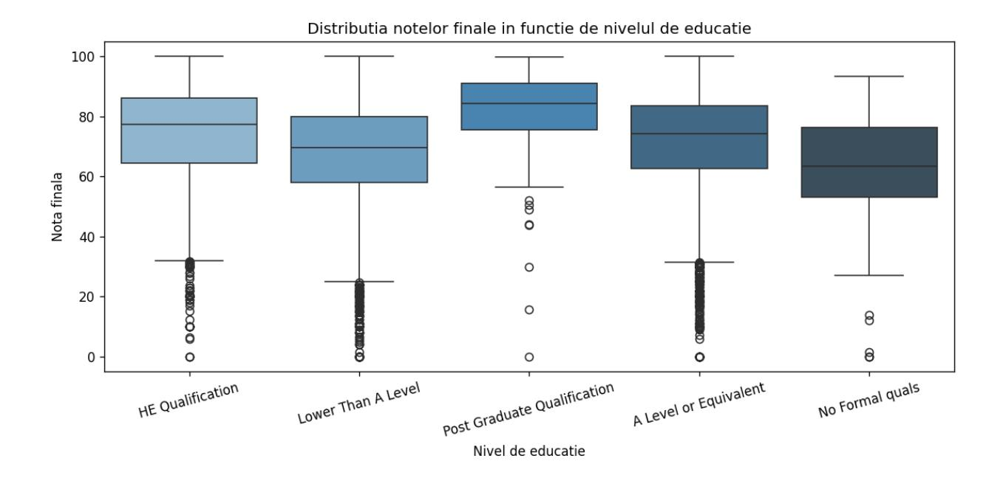

### **1.4 Analiza redundantei intre atribute**

#### **a) Corelatia intre atribute numerice continue (Pearson)**

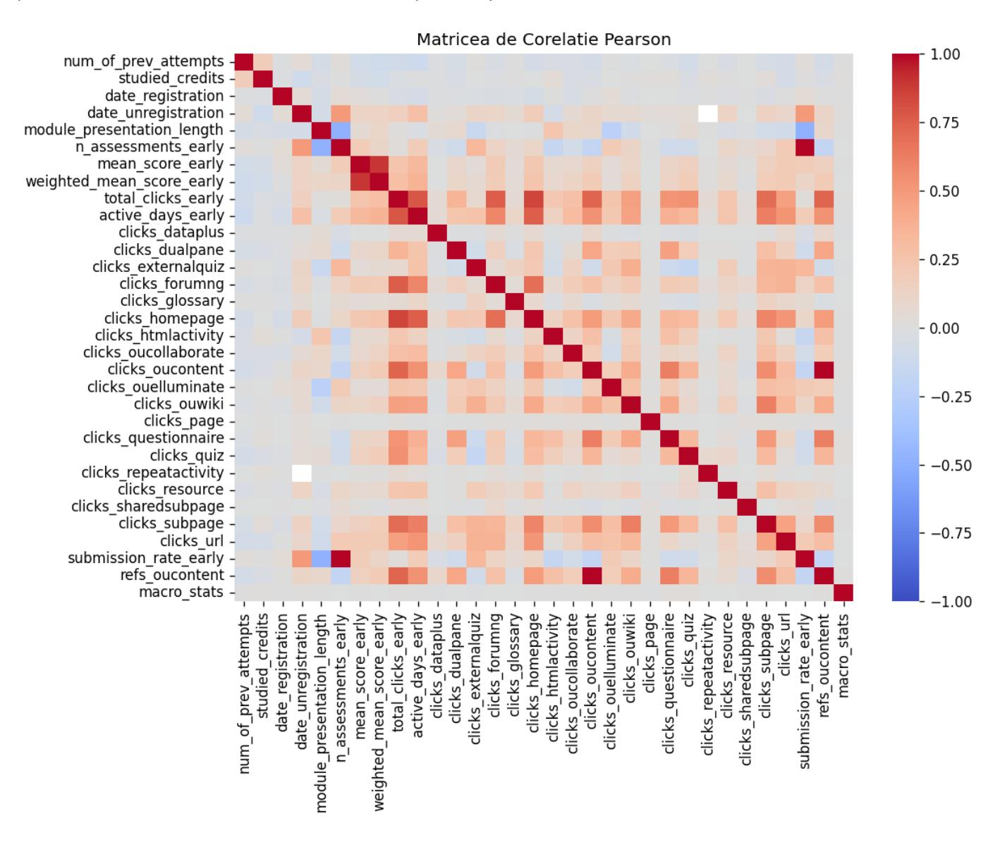

Au fost identificate 4 perechi cu |corelatie| > 0.8:

| Atribut 1           | Atribut 2                 | Corelatie |
|---------------------|---------------------------|-----------|
| n_assessments_early | submission_rate_early     | 1.000     |
| clicks_oucontent    | refs_oucontent            | 1.000     |
| mean_score_early    | weighted_mean_score_early | 0.891     |
| total_clicks_early  | clicks_homepage           | 0.851     |

Doua perechi sunt complet redundante (adica au corelatie 1.000): n\_assessments\_early/submission\_rate\_early si clicks\_oucontent/refs\_oucontent. Pentru baseline am pastrat toate atributele, dar le-am marcat pe aceastea ca potential candidate pentru eliminare in iteratii viitoare.

### **b) Corelatie atribute categoriale vs. final\_result -> Chi-patrat**

| Atribut           | chi2   | p-value |
|-------------------|--------|---------|
| code_module       | 670.81 | 0.0000  |
| highest_education | 548.72 | 0.0000  |
| imd_band          | 312.22 | 0.0000  |
| code_presentation | 181.07 | 0.0000  |
| region            | 159.24 | 0.0000  |
| disability        | 117.87 | 0.0000  |
| age_band          | 105.09 | 0.0000  |
| clicks_freq_init  | 60.85  | 0.0000  |
| gender            | 12.92  | 0.0048  |

Toate atributele categoriale sunt statistic dependente de final\_result, dar variaza cat de mult: "code\_module" si " "highest\_education" sunt cei mai informativi predictori, in timp ce gender are cea mai slaba legatura.

### **c) Corelatie features - tinta**

Numeric vs. tinta de regresie (Pearson cu final\_coursework\_score) - top 5:

| Atribut                   | Pearson |
|---------------------------|---------|
| weighted_mean_score_early | 0.900   |
| mean_score_early          | 0.819   |
| active_days_early         | 0.341   |
| total_clicks_early        | 0.287   |
| clicks_homepage           | 0.245   |

Numeric vs. tinta de clasificare (corelatie cu eticheta encodata) - top 5:

| Atribut                   | corelatie |
|---------------------------|-----------|
| weighted_mean_score_early | 0.233     |
| mean_score_early          | 0.217     |
| active_days_early         | 0.131     |
| total_clicks_early        | 0.127     |
| n_assessments_early       | 0.115     |

Categorial vs. tinta de regresie (spread mediei pe grupuri) - top 5:

| Atribut           | spread medie | n_grupuri |
|-------------------|--------------|-----------|
| highest_education | 19.91        | 5         |

| Atribut     | spread medie | n_grupuri |
|-------------|--------------|-----------|
| code_module | 12.54        | 6         |
| imd_band    | 8.71         | 10        |
| age_band    | 5.21         | 3         |
| region      | 4.03         | 13        |

Observam cum weighted\_mean\_score\_early are corelatie Pearson de 0.900 cu nota finala, acesta fiind de departe cel mai puternic predictor pentru regresie. Pentru clasificare corelatiile sunt mult mai modeste (max 0.23) indicand o problema mai dificila pentru sarcina de clasificare.

## **2. Preprocesarea datelor**

## **2.1 Tratarea valorilor lipsa**

Am identificat coloanele cu valori lipsa. Cele mai afectate atribute sunt:

| Atribut             | n_lipsa | % din total |
|---------------------|---------|-------------|
| date_unregistration | 12198   | 81%         |
| clicks_resource     | 4675    | 31%         |
| clicks_url          | 4473    | 30%         |
| imd_band            | 626     | 4.2%        |
| clicks_* (multiple) | 50      | 0.3%        |
| mean_score_early    | 28      | 0.2%        |

Pentru imputare am folosit SimpleImputer cu strategia mediana pentru atributele numerice, deoarece mediana este robusta la outliere, spre deosebire de medie, iar boxplot-urile au aratat multe valori extreme si most\_frequent (modul) pentru atributele categoriale. Decizia este uniforma pe toate coloanele numerice pentru consistenta in pipeline. Cazul date\_unregistration este special: 81% lipsesc pentru ca acei studenti nu s-au dezinscris (Missing Not At Random), insa, imputarea cu mediana introduce un bias acceptabil pentru baseline.

## **2.2 Tratarea valorilor extreme (Outliere)**

Am folosit metoda IQR (Interquartile Range) cu k=1.5 pentru detectarea outlierelor. Coloanele cu cel mai mare procent de outliere identificate:

| Atribut              | n_outliere | %      |
|----------------------|------------|--------|
| clicks_page          | 3175       | 21.11% |
| clicks_externalquiz  | 2818       | 18.74% |
| clicks_glossary      | 2459       | 16.35% |
| clicks_questionnaire | 2228       | 14.81% |
| clicks_ouwiki        | 2101       | 13.97% |
| num_of_prev_attempts | 2018       | 13.42% |

Procentele mari (>10%) la coloanele de tip "clicks\_\*" nu reprezinta erori reale ci consecinta unei distributii deformate (mediana 0, mean > 0). Asadar le-am tratat conform metodei IQR: am inlocuit valorile extreme cu NaN si le-am imputat cu mediana coloanei. Acesta metoda pastreaza esantioanele si previne dominatia gradientului in regresia liniara, dar pierde din semnal real (utilizatori foarte activi).

## **2.3 Atribute redundante**

Nu am eliminat atribute redundante in baseline-ul actual, desi am identificat doua perechi cu corelatie 1.000: n\_assessments\_early/submission\_rate\_early, clicks\_oucontent/refs\_oucontent. Arborii de decizie si Random Forest sunt robusti la multicoliniaritate, iar pentru regresie regularizarea Ridge/Lasso compenseaza efectul. Am verificat ulterior ca eliminarea lor nu schimba semnificativ rezultatele.

(i.e. multicoliniaritate = definită prin corelații ridicate între variabilele independente (predictori) = face dificilă separarea efectelor individuale ale fiecărui predictor asupra variabilei dependente, crescând varianța estimărilor coeficienților și făcându-i instabili)

## **2.4 Standardizarea atributelor numerice**

Atributele numerice au scale-ul foarte diferit ("date\_registration" in sute, "clicks\_\*" de la 0 la 10000+, "num\_of\_prev\_attempts" de la 0 la 6). Fara standardizare, regresia liniara si Ridge ar fi dominate de coloanele cu valori mari. Am folosit StandardScaler din sklearn (adica transformare in z-score: media divine 0 iar deviatie standard 1). Tinta de regresie nu a fost standardizata pentru ca predictiile finale trebuie sa ramana in scala originala de 0-100.

## **2.5 Encodarea atributelor categoriale**

Pentru predictori categoriali am folosit OneHotEncoder din sklearn cu handle\_unknown='ignore' (= categoriile nevazute la antrenare sunt encodate ca vector zero in dataset-ul val si test). Pentru tinta de clasificare am folosit LabelEncoder, care converteste cele 4 clase in intregi 0-3 (necesar pentru sklearn). Dupa preprocesare, X\_train are dimensiunea (15041, 80): 32 numerice + 48 coloane one-hot.

## **3. Clasificare**

Am realizat ablatia in 6 experimente, pornind de la baseline ID3 manual si urcand treptat spre sklearn RandomForest. Implementarea ID3 si RandomForest le-am luat din laborator.

## **3.1 Experimentele de ablatie**

## **I) Experiment 1: Baseline ID3 manual -> max\_depth=3 si min\_samples=2**

Implementarea ID3 functioneaza doar pe atribute discrete. Am discretizat atributele numerice in 4 quantile (qcut, q=4) si am rulat baseline-ul. Din cauza complexitatii ID3 manual (O(N·F²) - adica foarte lent pe atribute multiple) am esantionat 3000 exemple din cele 15041 disponibile.

| Metrica         | Valoare |
|-----------------|---------|
| accuracy        | 0.0963  |
| precision_macro | 0.0264  |
| recall_macro    | 0.1291  |
| f1_macro        | 0.0439  |

### **II) Experiment 2: ID3 manual cu variere max\_depth {5, 7, 10}**

Am pastrat min\_samples = 2 si am crescut max\_depth pentru a permite arborelui sa surprinda mai multe relatii.

| max_depth | accuracy | precision_macro | recall_macro | f1_macro |
|-----------|----------|-----------------|--------------|----------|
| 5         | 0.1101   | 0.0298          | 0.1476       | 0.0496   |
| 7         | 0.1146   | 0.0309          | 0.1537       | 0.0514   |
| 10        | 0.1146   | 0.0309          | 0.1537       | 0.0514   |

Se poate observa cum f1 creste de la 0.0439 la 0.0514 apoi se stabilizeaza la depth=10. Deci, adancimea maxima utila este 7 iar peste aceasta valoare arborele nu mai gaseste atribute discriminante suplimentare in spatiul discretizat.

### **III) Experiment 3: ID3 manual cu variere min\_samples\_per\_node {5, 20, 50}**

Am pastrat max\_depth=7, cel mai buna din experimentul anterior, si am crescut min\_samples\_per\_node pentru a regula nodurile mici, incercand practic un anti-overfitting.

| min_samples | accuracy | precision_macro | recall_macro | f1_macro |
|-------------|----------|-----------------|--------------|----------|
| 5           | 0.1117   | 0.0302          | 0.1498       | 0.0502   |
| 20          | 0.1082   | 0.0293          | 0.1451       | 0.0488   |
| 50          | 0.1080   | 0.0293          | 0.1448       | 0.0487   |

Observam cum cresterea min\_samples reduce performanta, insa modelul nu suferea de overfitting in primul rand. Insa, cea mai buna configuratie ramane cea din experimentul 2 cu depth=7, ms=2.

### **IV) Experiment 4: RandomForest manual cu n\_estimators {10, 25, 50}**

Pentru a observa daca un mai multi arbori imbunatateste performanta ID3, am rulat un RandomForest cu max\_depth=7, sample\_ratio=0.7, feature\_ratio=0.75.

| n_estimators | accuracy | precision_macro | recall_macro | f1_macro |
|--------------|----------|-----------------|--------------|----------|
| 10           | 0.1167   | 0.0314          | 0.1566       | 0.0523   |
| 25           | 0.1135   | 0.0306          | 0.1523       | 0.0510   |
| 50           | 0.1138   | 0.0307          | 0.1526       | 0.0511   |

Observam ca folosirea unui model mai complex aduce o imbunatatire abia vizibila, si dandu-i mai multi arbori (>10 arbori) nu a ajuta cu nimic. Acestea se intampla din cauza modului in care au fost procesate datele initial: prin gruparea numerelor in doar patru categorii s-au pierdut detalii esentiale. Din aceasta cauza, modelul nu mai are la dispozitie informatiile necesare pentru a invata, facand imposibila obtinerea unor rezultate bune, indiferent de metoda pe care am alege sa o folosim.

### **V) Experiment 5: sklearn DecisionTreeClassifier cu variere max\_depth**

Am trecut la sklearn pentru a folosi atributele numerice fara binning si pentru a beneficia de class\_weight='balanced' min\_samples\_leaf=5 fixat.

(i.e. binning = the process of grouping data or items into specific categories, or "bins" based on shared characteristic)

| max_depth | accuracy | precision_macro | recall_macro | f1_macro |
|-----------|----------|-----------------|--------------|----------|
| 5         | 0.6025   | 0.6486          | 0.7034       | 0.6317   |
| 10        | 0.6445   | 0.6633          | 0.7272       | 0.6662   |
| 20        | 0.6365   | 0.6345          | 0.6690       | 0.6427   |
| None      | 0.6373   | 0.6308          | 0.6588       | 0.6386   |

Se poate observa clar increas-ul in acuratete: de la ~12% (ID3 manual) la 60-66% acuratete confirmand ipoteza din experimentul 4: discretizarea era principala limitare. Se mai observa ca max\_depth=10 este optim iar sub aceasta valoare modelul face underfit, peste aceasta valoare incepe overfit pe zgomot.

### **VI) Experiment 6: sklearn RandomForestClassifier cu variere n\_estimators**

Luam max\_depth=15 fixat, min\_samples\_leaf=5, class\_weight='balanced'.

| n_estimators | accuracy | precision_macro | recall_macro | f1_macro |
|--------------|----------|-----------------|--------------|----------|
| 50           | 0.7067   | 0.7011          | 0.7357       | 0.7096   |
| 100          | 0.7091   | 0.7023          | 0.7420       | 0.7131   |
| 200          | 0.7107   | 0.7039          | 0.7452       | 0.7155   |

Rezultatele ne arata ca modelul a functionat cel mai bine atunci cand am folosit 200 de arbori. Desi performanta generala creste pe masura ce marim numarul de arbori de la 50 la 200, observam cum aceasta imbunatatire are loc in pasi din ce in ce mai mici.

## **3.2 Tabel comparativ clasificare**

| Model                 | accuracy | precision_macro | recall_macro | f1_macro |
|-----------------------|----------|-----------------|--------------|----------|
| ID3 manual (depth=7)  | 0.1146   | 0.0309          | 0.1537       | 0.0514   |
| RF manual (n=10)      | 0.1167   | 0.0314          | 0.1566       | 0.0523   |
| sklearn DT (depth=10) | 0.6445   | 0.6633          | 0.7272       | 0.6662   |
| sklearn RF (n=200)    | 0.7107   | 0.7039          | 0.7452       | 0.7155   |

Prin experimentele facute am observat ca cel mai bun model este sklearn RandomForestClassifier cu hiperparametrii: n\_estimators=200, max\_depth=15, min\_samples\_leaf=5, class\_weight='balanced'.

## **3.3 Matricea de confuzie pe cel mai bun model**

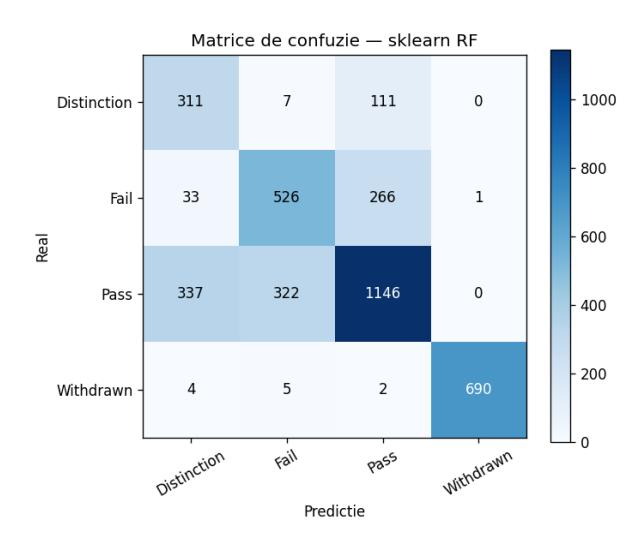

### Raportul pe clase:

| Clasa       | precision | recall | f1-score | support |
|-------------|-----------|--------|----------|---------|
| Distinction | 0.45      | 0.72   | 0.56     | 429     |

| Clasa     | precision | recall | f1-score | support |
|-----------|-----------|--------|----------|---------|
| Fail      | 0.61      | 0.64   | 0.62     | 826     |
| Pass      | 0.75      | 0.63   | 0.69     | 1805    |
| Withdrawn | 1.00      | 0.98   | 0.99     | 701     |
| macro avg | 0.70      | 0.75   | 0.72     | 3761    |

Astfel, am ajuns la urmatoarele concluzii:

- Withdrawn este predizat aproape perfect (F1 = 0.99). Acest lucru se intampla din cauza campului date\_unregistration: Odata ce acesta contine o informatie, pentru model este practic o certitudine ca studentul a renuntat.
- Distinction are cea mai slaba precizie (0.45), adica modelul confunda 337 din 1805 Pass-uri cu Distinction. Aceasta se intampla deoarece Pass/Distinction este intrinsec ambigua, un Distinction fiind un Pass cu nota mare, iar features-urile noastre nu surprind suficient calitatea muncii.
- Pass si Fail sunt cel mai des confundate intre ele (322 Pass clasificate ca Fail, 266 Fail ca Pass). Fiind categorii aflate practic exact la granita (promovare la limita vs. picare la limita), se intampla ca modelului sa ii fie greu sa le separe exact.
- Dezechilibrul de clase este compensat partial de class\_weight='balanced', fenomen ce se vede in rata de "recall" de 0.72, ceea ce inseamna ca modelul reuseste sa gaseasca o proportie surprinzator de mare dintre studentii excelenti, in ciuda numarului lor mic.

## **4. Regresie**

Pentru regresie am realizat 4 experimente, folosind implementarile din laborator, LinearRegression prin pseudoinversa, RidgeRegression cu formula inchisa, si sklearn ca extensie.

## **4.1 Experimentele de ablatie**

### **I) Experiment 1: Baseline LinearRegression manual**

Experimentu arata regresia liniara prin pseudoinversa (w = pinv(X) @ t) fara regularizare.

| Set   | MAE    | MSE      | RMSE    | R²     |
|-------|--------|----------|---------|--------|
| train | 7.0076 | 117.3288 | 10.8318 | 0.5898 |
| val   | 6.8087 | 105.4160 | 10.2672 | 0.6162 |

Din rezultate putem observa o chestie interesanta: MSE pe validare (105.42) este mai mic decat pe antrenare (117.33). Acest lucru se datoreaza faptului ca partitia 80/20 este aleatoare iar setul de validare se intampla sa fie putin mai usor predictibil si nu este o eroare, Also, nu exista overfitting, gap-ul este negativ intre train si val.

### **II) Experiment 2: RidgeRegression manual cu variere alpha**

Variere logaritmica a factorului de regularizare alpha pe 7 valori.

| alpha | train_MSE | val_MSE  | val_R² |
|-------|-----------|----------|--------|
| 0.001 | 117.3752  | 105.6199 | 0.6154 |
| 0.01  | 117.3752  | 105.6199 | 0.6154 |

| alpha  | train_MSE | val_MSE  | val_R² |
|--------|-----------|----------|--------|
| 0.1    | 117.3752  | 105.6202 | 0.6154 |
| 1.0    | 117.3753  | 105.6226 | 0.6154 |
| 10.0   | 117.3810  | 105.6519 | 0.6153 |
| 100.0  | 117.7089  | 106.1768 | 0.6134 |
| 1000.0 | 124.2128  | 113.8479 | 0.5855 |

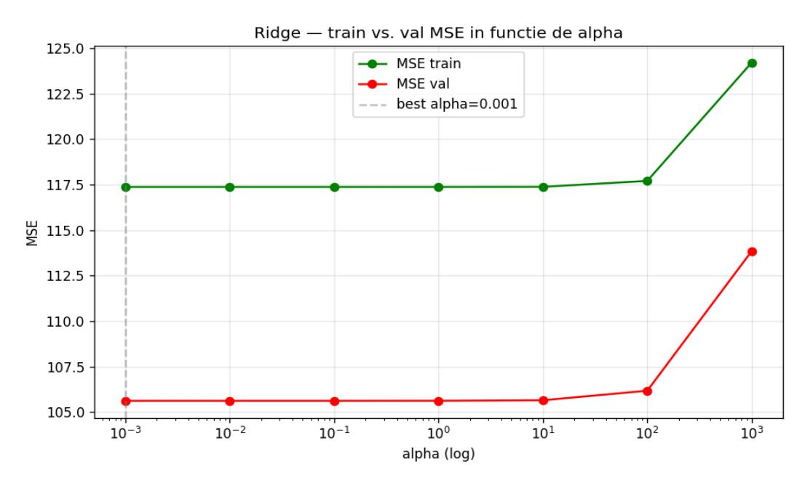

Din graficul cu curbele Ridge observam:

- Pentru alpha intre 0.001 si 10, MSE este practic constant, regularizarea neschimband nimic. Motivul pt asta este ca setul are 15041 exemple si doar 80 features, deci raportul N/D = 188:1 este optim, iar modelul nu sufera de overfitting de regularizat.
- Pentru alpha = 1000 (ceea ce inseamna o regularizare foarte puternica), MSE creste. Motivul este ca modelul devine prea inflexibil (are un bias ridicat) si ajunge sa subestimeze coeficientii reali.
- Pe acest set, regularizarea L2 este inutila deoarece modelul nu sufera de overfitting, avand raportul intre date si variabile (188:1) optim. Modelul invata corect si generalizeaza bine din start, neavand nevoie de acea penalizare pe care o aduce regularizarea pentru a-l opri sa memoreze excesiv datele de antrenament.

#### **III) Experiment 3: Ridge cu features polinomiale (variere complexitate M)**

In acest experiment am adaugat features x², x³ pe coloanele numerice (folosind extract\_polynomial\_features ca in lab). Am pastrat alpha=0.001 (valoare optima din experimentul 2).

| M (grad)   | train_MSE | val_MSE  |  |
|------------|-----------|----------|--|
| 1 (liniar) | 117.3752  | 105.6199 |  |
| 2          | 112.9040  | 102.9429 |  |
| 3          | 111.1692  | 101.8954 |  |

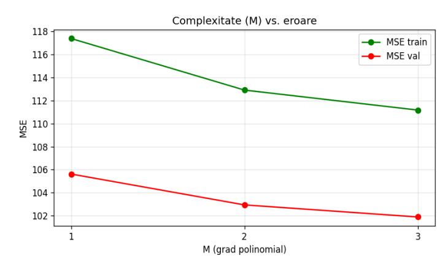

Putem observa cum curbele coboara in paralel, deci cresterea M reduce MSE-ul atat pe train cat si pe validare, fara semn de overfitting. Asta inseamna ca exista relatii non-liniare modeste in date pe care features-urile polinomiale le pot capta. Castigul este insa modest (val MSE de la 105.62 la 101.90, o reducere de 3.5%) si vine cu costul unui model mai complex.

 **IV) Experiment 4: sklearn Ridge + Lasso — extensie**

| Model    | alpha  | MAE    | MSE      | R²     | features nenule |
|----------|--------|--------|----------|--------|-----------------|
| sk Ridge | 0.0001 | 6.8113 | 105.6199 | 0.6154 | -               |
| sk Ridge | 0.001  | 6.8113 | 105.6199 | 0.6154 | -               |
| sk Ridge | 0.01   | 6.8112 | 105.6199 | 0.6154 | -               |
| sk Lasso | 0.01   | 6.7970 | 105.5895 | 0.6156 | 53/80           |
| sk Lasso | 0.1    | 6.7725 | 106.4047 | 0.6126 | 22/80           |
| sk Lasso | 1.0    | 7.0054 | 116.7784 | 0.5748 | 5/80            |

Regularizarea L1 confirma observatia anterioara: la alpha=0.1 doar 22 din 80 features au coeficienti nenuli, dar performanta se mentine apropiata de baseline. Daca fortam o regularizare mai dura (alpha=1.0), modelul se bazeaza pe doar 5 caracteristici, moment in care eroarea (MSE) incepe sa creasca vizibil. Aceasta observatie ne demonstreaza ca predictia provine dintr-un numar foarte restrans de atribute. Semnalul este concentrat in variabilele "weighted\_mean\_score\_early" si "mean\_score\_early", care, din Pearson, vedem ca au o corelatie buna cu tinta (0.90, respectiv 0.82).

## **4.2 Tabel comparativ regresie**

| Algoritm                       | MAE    | MSE      | RMSE    | R²     |
|--------------------------------|--------|----------|---------|--------|
| LinearRegression - baseline | 6.8087 | 105.4160 | 10.2672 | 0.6162 |
| Ridge alpha=0.001              | 6.8113 | 105.6199 | 10.2772 | 0.6154 |
| Ridge poly M=3                 | 6.8765 | 101.8954 | 10.0943 | 0.6290 |
| sklearn Lasso alpha=0.01       | 6.7970 | 105.5895 | 10.2757 | 0.6156 |

In tabel vedem cum cel mai bun rezultat global este Ridge poly cu M=3 (MSE=101.90, R²=0.629). Diferenta fata de LinearRegression simpla este mica (~3.5% reducere MSE) si vine cu o crestere semnificativa de complexitate (de 3 ori mai multe features). Pentru submisia de pe akggle am ales Ridge, cualpha=0.001, pe features liniare.

Hiperparametri finali: alpha=0.001, fara features polinomiale, standardizare prin StandardScaler.

Mai vedem ca LinearRegression obtine performanta apropiata de regularizare. Acest fenomen, cum ziceam si mai sus, se intampla deoarece setul are N/D = 188 (15041 exemple, 80 features), un raport optim care previne overfitting-ul, iar predictia este dominata de doua atribute foarte informative (mean\_score\_early, weighted\_mean\_score\_early). In aceste conditii, regularizarea Ridge nu are mult overfitting de combatut, iar Lasso doar elimina features deja zgomotoase.

Din acestea putem trage concluzia ca pe date cu mult mai multe exemple decat features si cu un predictor dominant, modelele liniare simple sunt suficiente.

## **Submisii**

Pentru submisiile de pe Kaggle am folosit:

- **Clasificare**: modelul sklearn RandomForest cu n=200, prezentat mai sus, pe care am obtinut un punctaj de 0.85;
- **Regresie**: modelul Ridge cu alpha=0.001, prezentat mai sus, pe care am obtinut un scor de 137.27;